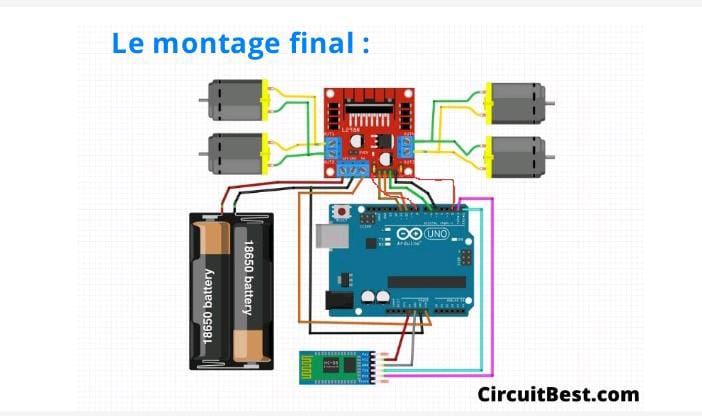
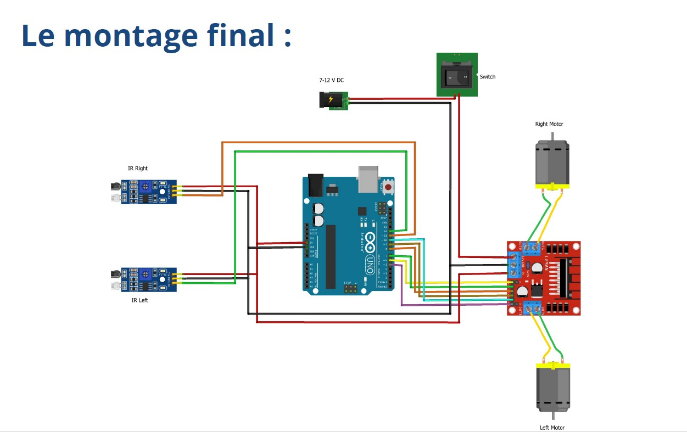

# Bluetooth Self-Driving and Follower Car with Arduino Uno

## Overview

This project involves creating a self-driving car and a follower car that communicate using Bluetooth. The self-driving car utilizes sensors and algorithms to navigate autonomously, while the follower car mimics the movements of the self-driving car.

### Features

- **Self-Driving Car:**
  - Uses Arduino Uno microcontroller.
  - Implements autonomous navigation with sensors.
  - Bluetooth communication for control.

- **Follower Car:**
  - Arduino Uno powered.
  - Mimics the movements of the self-driving car through Bluetooth.

## Components

- Arduino Uno
- DC Motors
- Motor Drivers
- Bluetooth Module (e.g., HC-05)
- Sensors for self-driving car (e.g., Ultrasonic sensors, IR sensors)
- Chassis for both cars
- Power source (e.g., batteries)

## Wiring Diagram

Include a simple wiring diagram to help users understand how to connect the various components. You can use tools like Fritzing or draw.io to create diagrams.




## Setup Instructions

1. **Clone the Repository:**
   ```bash
   git clone https://github.com/your-username/arduino-bluetooth-self-driving-car.git
   # Getting Started

## Install Arduino IDE

Download and install the Arduino IDE from [https://www.arduino.cc/en/software](https://www.arduino.cc/en/software).

## Open Arduino Sketch

Open the Arduino sketch for the self-driving car and the follower car separately in the Arduino IDE.

## Upload Code

Upload the code to the respective Arduino Uno boards.

## Assemble the Cars

Assemble the chassis, motors, and other components as per the provided wiring diagram.

## Power On

Power on both the self-driving and follower cars.

## Pair Bluetooth Devices

Pair the Bluetooth module on the self-driving car with the one on the follower car.

## Control

Use a Bluetooth-enabled device to control the self-driving car, and observe the follower car mimic its movements.

# Code Structure

- **`self_driving_car.ino`:**
  - Contains the code for the self-driving car.
  
- **`follower_car.ino`:**
  - Contains the code for the follower car.

# License

This project is licensed under the MIT License.

# Acknowledgments

Mention any libraries, tutorials, or resources you used or were inspired by.

# Contributing

Feel free to contribute by opening issues or creating pull requests.

